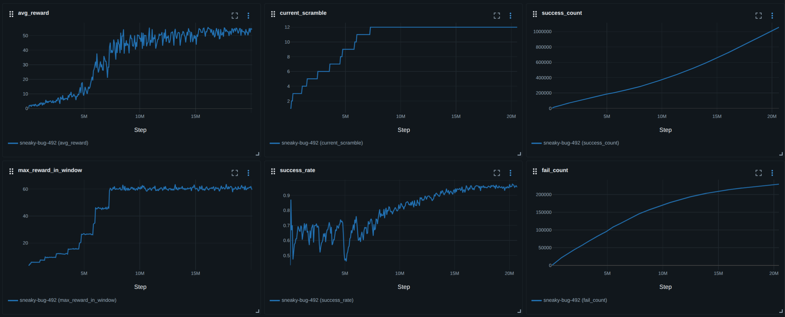

# Rubik-RL: Reinforcement and Imitation Learning for Solving the 2×2×2 Cube

Rubik-RL is a research-oriented project that combines **Reinforcement Learning (RL)** and **Imitation Learning (IL)** to solve the 2×2×2 Rubik’s Cube.  
The system consists of two independently trained models:

1. **RL agent** – responsible for solving the first layer.  
2. **IL model** – trained to solve the second layer using predefined algorithms.

<p align="center">
  
  <br><em>Training progress and metrics tracked in MLflow.</em>
</p>


## Overview

The project introduces a fully custom Rubik’s Cube environment implemented in PyTorch and designed for training RL and IL agents using PyTorch.
It supports curriculum learning, several reward schemes, and detailed evaluation of learned behaviors.

**Example usage:**

The 2016 WR scramble was used:
```bash
python run_pipeline.py --scramble "U' R F R U R F' U' R2 U' F"
```
Example generated output:
```bash
Full solution (5 moves): F2 B L U B'
```

## Results and Evaluation

The training and evaluation results indicate that the curriculum and reward shaping strategies lead to stable convergence of both models.

### Reinforcement Learning (First Layer)

| Setting | Max Steps | Training Accuracy | Evaluation Accuracy | Notes |
|----------|------------|-------------------|----------------------|--------|
| Baseline | 30 | 97% | 69% | Model trained with curriculum learning (max_steps=30); shorter evaluation horizon limits success on longer scrambles |
| Extended | 100 | 97% | ~99% | Same trained model; evaluation horizon extended to 100 steps allows convergence to be achieved |

The RL agent demonstrates strong convergence when evaluated with a longer step horizon, indicating that the learned policy effectively generalizes and benefits from extended reward propagation across longer trajectories.

The initial drop in evaluation accuracy for shorter step limits is expected. It reflects the fact that, under the curriculum learning setup, the agent gradually adapts from easier to more complex scrambles. With limited steps, some longer scrambles cannot be completed within the episode horizon, but the agent ultimately generalizes well when given sufficient steps.


### Imitation Learning (Second Layer)

| Model | Accuracy | Notes |
|--------|-----------|--------|
| IL Classifier | 100% | Consistent results across mirrored and rotated states |

The imitation learning model achieves perfect accuracy on the augmented dataset, indicating that the mirrored and rotated algorithms fully cover all possible cases.


## Reinforcement Learning (First Layer)

**Environment:** `envs/rubik2x2_env.py`  
**Agent:** Deep Q-Network (DQN) implemented in `agents/dqn_agent.py`

### Main Features

- **Custom 2×2×2 Environment**   
  - Encodes cube states using a one-hot vector of length `24 stickers × 6 colors = 144`.    
  - To achieve maximal state entropy in this environment, mathematically 11 non-repeating moves are sufficient; for training, 12 moves were used to ensure the cube state is truly randomized.
  - Implemented from scratch with deterministic transitions and support for visual rendering. 

- **Curriculum Learning**  
  - Training difficulty increases gradually by extending the scramble length.  
  - Optional epsilon reset/decay mechanisms are implemented, but in practice, random scrambles provide sufficient exploration.

- **Reward Shaping**  
  - Intermediate rewards for correctly oriented or placed corners.  
  - A final reward for completing the entire first layer.  
  - Penalties for moves that undo progress or are useless and do not contribute to solving the cube.  
  - Reward magnitudes are scaled according to the scramble difficulty.  
  - A delta term tracks progress between consecutive states, emphasizing learning stability.  
  - Multiple alternative reward systems are available under `envs/rewards/`.

- **Replay Buffer**  
  - Implements experience replay to reinforce meaningful transitions and stabilize training.

- **Logging and Experiment Tracking**  
  - All metrics, parameters, and training curves are tracked via **MLflow** (`mlruns/` directory).


## Imitation Learning (Second Layer)

**Training:** `training/train_il.py`  
**Data generation:** `scripts/generate_CLL_variants.py`

### Main Features

- **LBL Solver Integration**  
  A Layer-By-Layer solver is used to generate first-layer-completed states for second-layer evaluation.

- **Demonstration Generation**  
  The dataset is built from algorithmic solutions such as **CLL**, **Y-perm**, and **J-perm**, extended with mirror and rotation variants.  
  All demonstrations are checked for duplicates to ensure dataset uniqueness.

- **Evaluation and Coverage**  
  The trained IL classifier achieves complete coverage of all possible second-layer cases, ensuring reliable performance on any first-layer-completed state.


## Project Structure

```yaml
Rubik-RL/
├── agents/                              # Folder containing RL agents and related modules
│   ├── __init__.py                      # Package initializer
│   ├── dqn_agent.py                     # DQN agent implementation and training loop
│   ├── q_network.py                     # Q-network architecture
│   └── replay_buffer.py                 # Replay buffer for storing experiences
├── datasets/                            # Folder with demonstration datasets for IL
│   ├── upper_layer_algorithms.json      # Basic set of algorithms for upper layer
│   └── upper_layer_algorithms_full.json # Full set of algorithms for upper layer
├── envs/                                # Folder containing the cube environment
│   ├── rewards/                         # Reward related files
│   │   ├── reward_helpers.py            # Helper functions for rewards
│   │   └── reward_interface.py          # Reward shaping methods
│   ├── __init__.py
│   ├── cube_state.py                    # Cube state representation
│   ├── lbl_solver.py                    # LBL solver used to generate IL states
│   ├── render_utils.py                  # Utilities for visualizing the cube
│   └── rubik2x2_env.py                  # Gym environment for the 2x2x2 cube
├── experiments/                         # Folder with experiment results
│   └── experiment_results.csv           # CSV with experiment logs
├── images/                              # Folder for images and plots
├── mlruns/                              # Folder containing MLflow logs
├── models/                              # Folder for saved models
│   ├── il_classifier.pth                # Trained IL model
│   └── rl_agent.pth                     # Trained RL model
├── scripts/                             # Utility scripts
│   ├── check_dataset_consistency.py     # Checks dataset consistency
│   ├── eval_il_model.py                 # IL model evaluation
│   ├── eval_lbl.py                      # LBL solver tests
│   ├── evaluate_rl_model.py             # RL model evaluation
│   └── generate_CLL_variants.py         # Generate CLL, Y-perm, J-perm variants
├── training/                            # Folder with training loops
│   ├── __init__.py
│   ├── rl_experiment_planner.py         # Planner for running RL experiments
│   ├── train_il.py                      # IL model training
│   └── train_rl.py                      # RL model training
├── .gitignore                           # Git ignore file
├── LICENSE                              # Project license
├── README.md                            # Project README
├── run_pipeline.py                      # Script to run both models sequentially
└── requirements.txt                     # Python dependencies
```


## Setup and Usage

### Installation
```bash
pip install -r requirements.txt
```
### Training

Train the reinforcement learning model with carefully chosen hyperparameters:
```bash
python -m training/rl_experiment_runner.py
```
Train the imitation learning model:
```bash
python -m training/train_il.py
```
### Evaluation
```bash
python scripts/evaluate_rl_model.py
python scripts/eval_il_model.py
```
### Running the Full Pipeline
A single script allows running both models in sequence on a given scramble, demonstrating a complete solution of the 2×2×2 cube:

```bash
python run_pipeline.py --scramble "<your_scramble_sequence>"
```


## Technical Details

| Feature | Description |
|----------|-------------|
| RL Algorithm | Deep Q-Network (DQN) |
| Curriculum Strategy | Gradual increase of scramble depth |
| Exploration | *Optional epsilon reset or decay per curriculum stage |
| Reward Shaping | Progress-based with scaled penalties and bonuses |
| State Encoding | One-hot (144-dimensional) |
| IL Augmentation | CLL, Y-perm, J-perm with mirrors and rotations |
| Frameworks | PyTorch, MLflow |
| Environment | Deterministic 2×2×2 cube simulator |


## License

Rubik-RL is released under the MIT license.

## Author

Sebastian Brzustowicz &lt;Se.Brzustowicz@gmail.com&gt;